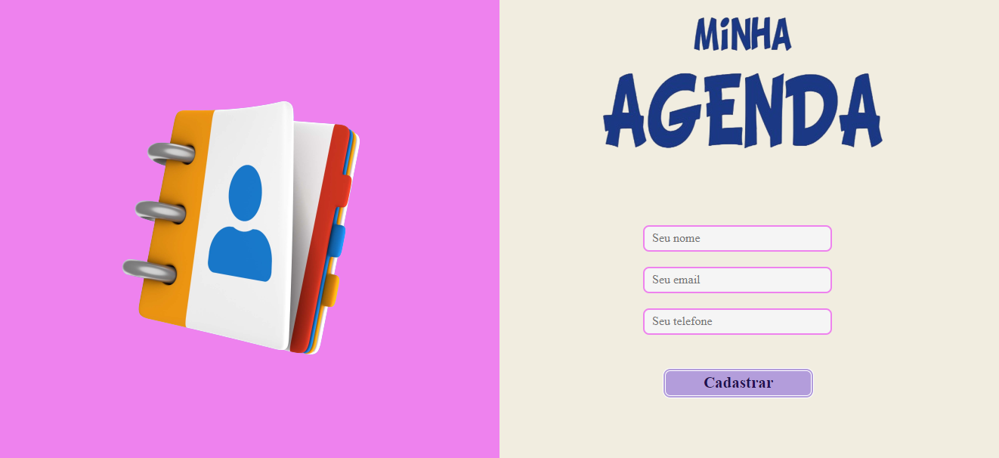
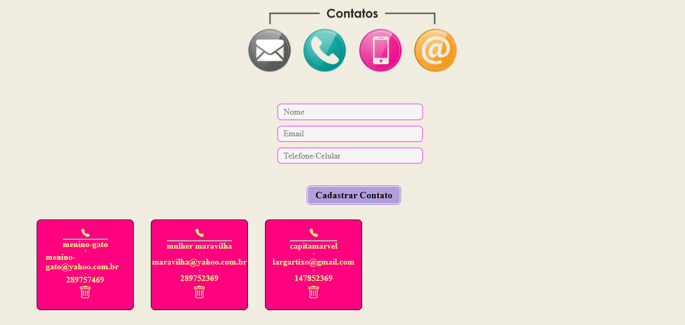

<h1 align="center">Front-end para API Minha Agenda</h1>

  

- Simula uma agenda virtual, onde o usuário se cadastra e também cadastra e deleta seus contatos. Aplicação em Reactjs.
- Link: https://projetominhaagenda.vercel.app/

## Tecnologias e ferramentas :wrench:

- React
- Styled-components
- React icons
- Axios
- React-hook-form
- React-toastify
- Yup
- React-router-dom

## Como utilizar:

### BASE URL:

https://github.com/suellykarine/projeto-minhaagenda-frontend

- Clone o repositório
- Rode a aplicação em localhost

### BASE API:

https://github.com/suellykarine/api-res-minhaagenda

- Clone o repositório da api
- Rode a aplicação em localhost
- Projeto em Nodejs

# Layout

